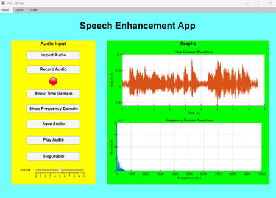
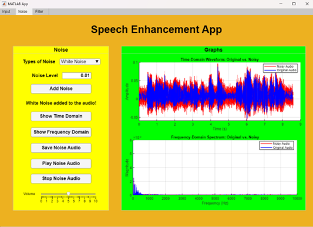
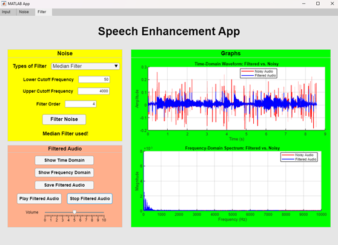

# Speech-Enhancement-App

This is one of my MATLAB project aim to enhance speech clarity by identifying what type of filters are best at filtering different types of noise, it has a simple and user-friendly interface for users to import an input/record audio and users can start selecting the type of noise they want to mix with with the input audio. Then the user can select different types of filter to filter the audio, the user can also play the audio to check for sound quality. This program will also display the time-domain waveform and frequency-domain waveform of the audio signal. The different types of noise available in the program are White noise, Babble noise, Pink noise, Impulse noise and the different types of filter available in the program are Butterworth filter, Chebyshev filter, FIR filter, Median filter, Spectral subtraction. Overall, this program serves as a simulation for users before making the physical circuit for speech enhancement.

Concepts learned:
- The basic coding of MATLAB: like programing the interface etc
- The workings of each filter: To program a filter, we first have to understand the fundamental workings of the filter

Below shows a demo for the program.

 

    

 

    

 

    

